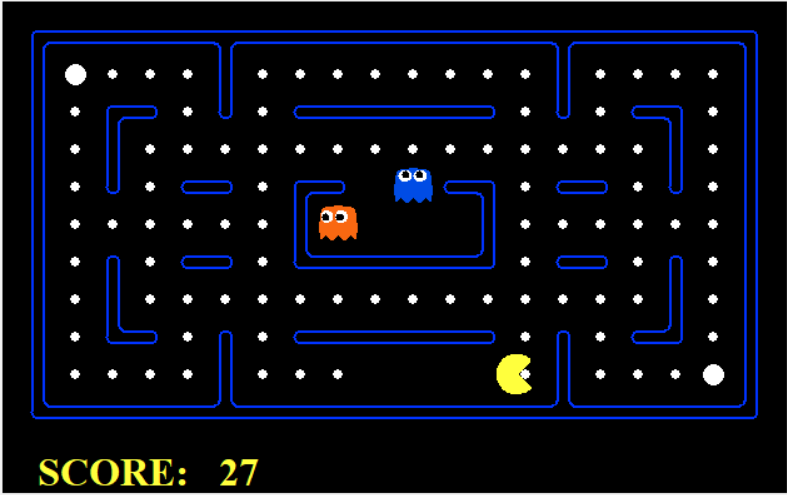

# 👾 Pac-Man Multi-Agent AI Project

This repository showcases solutions for the Multi-Agent Pac-Man assignment from UC Berkeley's CS188: Introduction to Artificial Intelligence course.




## 🚀 Project Overview

- **Adversarial Search Algorithms**
- **Evaluation Functions**

## 🗂️ Project Structure

- `pacman.py`: Main game logic
- `game.py`: Core game mechanics
- `search.py`: Implementation of search algorithms
- `searchAgents.py`: Search-based Pac-Man agents
- `multiAgents.py`: Multi-agent search implementations

## 🛠️ Installation

1. **Clone the repository**:

   ```bash
   git clone https://github.com/asalmohammadjafari/pacman-multiagent.git
   ```

2. **Navigate to the project directory**:

   ```bash
   cd pacman-multiagent
   ```

3. **Ensure Python 3.x is installed**

## 🎮 Usage

Run the game with different agents:

- **ReflexAgent**:
  ```bash
  python pacman.py -p ReflexAgent
  ```
- **MinimaxAgent**:
  ```bash
  python pacman.py -p MinimaxAgent
  ```
- **AlphaBetaAgent**:
  ```bash
  python pacman.py -p AlphaBetaAgent
  ```
- **ExpectimaxAgent**:
  ```bash
  python pacman.py -p ExpectimaxAgent
  ```

For additional options:
```bash
python pacman.py -h
```


## 📝 Credits and License

Based on the Pac-Man assignments from UC Berkeley's AI course (CS188).
Licensed under the MIT License.
